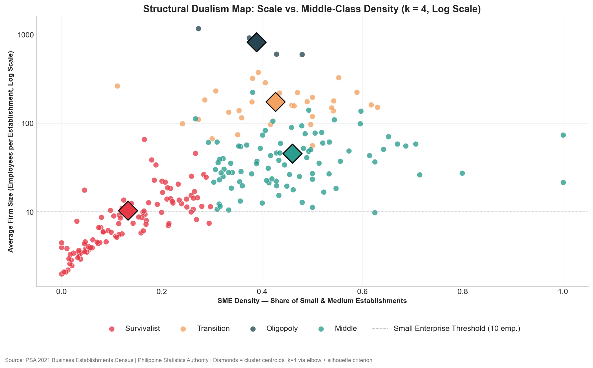
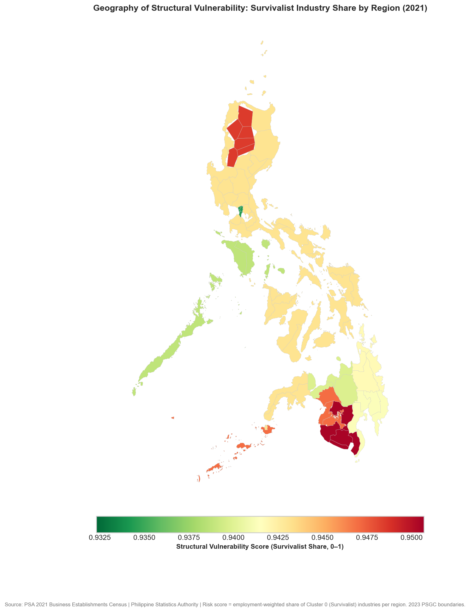
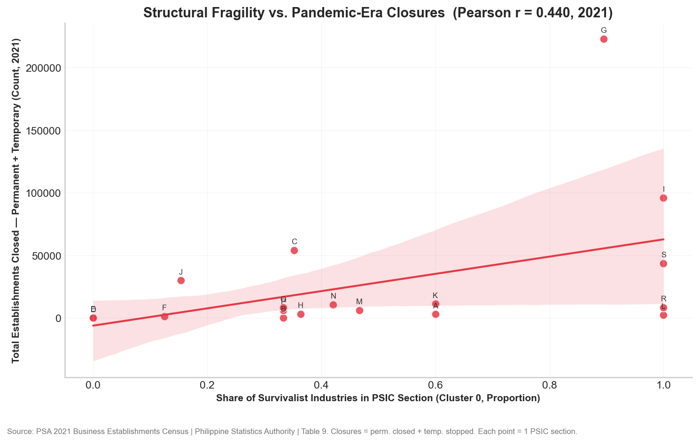

# An Econometric Taxonomy for Policy

### Quantifying Structural Vulnerability via K-Means Clustering of Philippine Industries


A data-driven industrial taxonomy revealing that structure, not sector, determines economic resilience in the Philippines.


> Philippine MSME policy treats 99.5% of businesses identically. This study uses K-Means clustering on 228 industries to prove that structural fragility predicts pandemic-era closures (r = 0.44), and recommends replacing uniform MSME policy with archetype-specific interventions.


<details>
<summary><strong>Table of Contents</strong></summary>

- [About the Project](#about-the-project)
- [Key Findings](#key-findings)
- [Four Economic Archetypes](#four-economic-archetypes)
- [Methodology](#methodology)
- [Skills & Technologies](#skills--technologies)
- [Repository Structure](#repository-structure)
- [Reproducibility](#reproducibility)
- [Paper & Citation](#paper--citation)
- [Project Status & Limitations](#project-status--limitations)
- [Authors](#authors)
- [License](#license)

</details>


## About the Project

Micro, small, and medium enterprises (MSMEs) comprise 99.5% of all registered establishments in the Philippines and generate the majority of employment. Successive administrations have pursued uniform policies targeting this bloc, treating a subsistence sari-sari store and a scalable tech startup as equivalent entities under the same regulatory and credit frameworks.

The Philippine Standard Industrial Classification (PSIC) groups industries by product output, not by how they operate. A micro-bakery and a semiconductor fabricator both fall under "Manufacturing" — despite having fundamentally different capital structures, labor profiles, and resilience to economic shocks. The classification system itself obscures the "missing middle": a hollowed-out industrial structure where a vast base of hyper-fragile micro-enterprises coexists with a thin layer of conglomerates, with little in between.

This study constructs a data-driven industrial taxonomy using K-Means clustering on the firm-size distributions of 228 three-digit PSIC industries. Using establishment and employment data from the Philippine Statistics Authority's 2021 Census of Establishments, we engineer a three-dimensional "structural fingerprint" — average firm size, SME density, and large-firm density — and segment the Philippine economy into four distinct structural archetypes. The taxonomy is validated through Shannon Entropy, bootstrapped cluster stability (ARI = 0.97), K-Medoids robustness checks, and an OLS regression linking structural fragility to pandemic-era business closures (r = 0.44). This research was conducted at De La Salle University (Manila) for the DATA100 course, Fundamentals of Data Science.

### Research Questions

- To what extent does the traditional 1-digit PSIC classification mask structural heterogeneity at the granular level?
- Can a K-Means taxonomy based on firm-size distributions provide a superior framework for identifying an industry's vulnerability to systemic shocks?
- How are these structural archetypes geographically distributed across Philippine regions, and what targeted policy interventions does the taxonomy suggest?


## Key Findings

### Structure Predicts Failure

A bivariate OLS regression of pandemic-era business closures on the share of Survivalist industries within each sector yields r = 0.44 (p = 0.068), suggesting that structural fragility is a measurable predictor of vulnerability to systemic shock. Sectors with 100% Survivalist composition — Accommodation and Food Service, Other Services — suffered the highest closure rates. By contrast, Electricity and Gas (0% Survivalist) demonstrated anti-fragility.

### The Survivalist Trap

Once an industry's micro-enterprise density exceeds 80%, average firm size hits a structural glass ceiling near 10 employees. The economy is bimodal: industries are either hyper-fragile micro-agglomerations or capital-intensive oligopolies, with a sparsely populated transition zone.

### Regional Risk Compression

Structural risk scores across all 17 Philippine regions range from 0.93 to 0.95, indicating nationwide structural fragility. Even the National Capital Region (0.934) — the country's financial and administrative hub — is underpinned by a massive informal service economy. Peripheral regions like Zamboanga Peninsula (0.951) are almost entirely dependent on Survivalist industries.

| Finding | Metric |
|---------|--------|
| Structure predicts failure | r = 0.44 |
| The Survivalist trap | 80% micro-density glass ceiling |
| Regional risk compression | 0.93 -- 0.95 range nationwide |


Average firm scale plotted against SME density reveals four distinct archetypes. The Survivalist cluster (purple, bottom-left) traps the majority of industries below 10 employees. The Middle cluster (yellow, center-right) and Oligopoly cluster (green, far-right) occupy structurally separate regions of the economy, with a sparse transition zone between them.


A choropleth map of the Philippines showing regional structural risk scores (0.93 -- 0.95 range). Darker regions (Zamboanga Peninsula, SOCCSKSARGEN) exhibit near-total dependence on Survivalist industries. The compression of scores across all regions suggests nationwide structural fragility that uniform MSME policy cannot address.


The positive correlation between Survivalist industry share and business closures (r = 0.44) demonstrates that firm-size distribution is a structural determinant of economic resilience, not merely a descriptive statistic.


## Four Economic Archetypes

The K-Means solution (k = 4, validated by Elbow Method and Silhouette Coefficient of 0.4946) segments 228 Philippine industries into four structural archetypes:

| Archetype | Industries | Avg. Firm Size | Entropy (H) | Description |
|-----------|-----------|-------|-------------|-------------|
| Survivalist | 103 | ~10 employees | ~0.41 | Hyper-fragile micro-enterprises in structural monoculture. Near-zero SME or large-firm presence. Trapped in low-productivity equilibrium. |
| Middle | 90 | ~46 employees | ~0.89 | Growth engines with partial escape from micro-dominance. The policy-accessible "missing middle" — structurally distinct from Survivalists but lacking scale for autonomous growth. |
| Transition | 31 | ~175 employees | ~1.18 | Highest structural diversity. Industries demonstrating capacity to graduate from SME to large-firm scale. The closest approximation to a healthy firm-size distribution. |
| Oligopoly | 4 | ~823 employees | ~1.13 | Capital-intensive apex sectors (semiconductors, aerospace, HR pooling). Highly concentrated, operationally independent of local credit constraints, but structurally narrow. |

*Note: Archetype labels are descriptive analytics for policy targeting, not normative judgments. Entropy values are approximate medians; cluster-level means are reported in the full paper. The Oligopoly cluster (n = 4) centroid is sensitive to individual industry inclusion — see limitations.*

Shannon Entropy analysis confirms that these archetypes represent a monotonic increase in structural diversity (ANOVA: F = 173.74, p < 0.001), from Survivalist monoculture through the Middle and into the Transition and Oligopoly clusters.


## Methodology

The Philippine Statistics Authority's 2021 Census of Establishments and Updating of the List of Establishments (ULE) provided establishment counts, employment, and closure data at the three-digit PSIC industry level, yielding 228 industries after list-wise deletion. See the [data dictionary](data/dictionary.md) for full variable descriptions.

Three structural fingerprints were derived for each industry: average firm size (total employment / total establishments), SME density (proportion of firms with 10--199 employees), and large-firm density (proportion with 200+ employees). These features model the firm-size distribution without the perfect collinearity that would arise from including all four MSME size bins.

K-Means with k = 4 was selected through dual-protocol validation: the Elbow Method (WCSS inflection point) and Silhouette Coefficient (0.4946). Features were standardized via StandardScaler. The four-cluster solution was chosen over the Silhouette-maximized k = 2 to preserve structural resolution for policy targeting.

Four robustness checks confirm the taxonomy's stability:
- Cluster stability: Pairwise Adjusted Rand Index = 0.97 across 50 random seeds
- K-Medoids (PAM): Four-archetype structure preserved under outlier-robust algorithm (ARI = 0.86)
- ANOVA: Cluster means differ significantly (p < 0.001) on both firm size and entropy
- Model comparison: Cluster-based survivalist share (Model B) achieves R-squared = 0.19 on 18 observations without overfitting, against a saturated PSIC-dummy model (Model A) with zero residual degrees of freedom

An OLS model of pandemic-era closures on Survivalist industry share at the one-digit PSIC section level (n = 18) yields a suggestive correlation (r = 0.44, p = 0.068, post-hoc power = 0.58) that is underpowered due to data aggregation constraints. Ecological inference applies: closure data is available only at the one-digit section level, while the taxonomy is constructed at the three-digit level.


## Skills & Technologies

| Domain | Tools |
|--------|-------|
| Languages | Python, LaTeX |
| Data Science | pandas, numpy, scipy, scikit-learn, statsmodels |
| Visualization | matplotlib, seaborn |
| Spatial Analysis | geopandas |
| Workflow | uv, Jupyter, git |
| Research Methods | K-Means, PCA, Bootstrapping, Econometric Regression, Shannon Entropy, ANOVA, APA 7 |


## Repository Structure

```
Taxonomy/
├── main.ipynb              # Full analysis pipeline (data ingestion -> clustering -> visualization)
├── main.pdf                # Complete research paper (40+ pages, ACM dual-column format for arXiv)
├── data/
│   ├── dictionary.md       # Full data dictionary with variable definitions
│   └── main data set.xlsx  # PSA 2021 source data (Tables 1--9)
├── images/                 # 13 publication-quality figures
│   ├── fig_cluster_dualism_map.png
│   ├── fig_structural_dualism_scatter.png
│   ├── fig_geographical_risk.png
│   ├── fig_regression_stress_test.png
│   ├── fig_elbow_silhouette.png
│   ├── fig_entropy_boxplot.png
│   ├── fig_heatmap_centroids.png
│   ├── fig_anova_boxplots.png
│   ├── fig_cluster_stability_ari.png
│   ├── fig_kmedoids_robustness.png
│   ├── fig_micro_density_histogram.png
│   ├── fig_model_comparison.png
│   └── fig_province_distribution.png
├── paper/                  # LaTeX source, ACM stylesheets, and bibliography
├── experiments/            # Exploratory notebooks (k=2 sensitivity analysis)
├── LICENSE                 # MIT License
└── CITATION.cff            # Citation metadata
```


## Reproducibility

This project uses [uv](https://docs.astral.sh/uv/) for dependency management. Python 3.11.11 is required.

```bash
# Clone the repository
git clone https://github.com/sakudiff/philippine-industrial-taxonomy.git
cd Taxonomy

# Install dependencies
uv pip install -r requirements.txt

# Execute the full analysis pipeline
jupyter nbconvert --to notebook --execute main.ipynb
```

All source data is included in the `data/` directory (retrieved from the Philippine Statistics Authority's 2021 Census of Establishments). The notebook reads from this directory directly and produces all figures shown in the paper.


## Paper & Citation

The complete research paper (40+ pages, ACM dual-column format) is available as [main.pdf](main.pdf) at the repository root. The paper uses the ACM `acmart` template and is formatted for arXiv submission.

If you use this research or software in your work, please cite it as:

```bibtex
@software{divina_cuevas_sison_2025_taxonomy,
  title        = {{An Econometric Taxonomy for Policy: Quantifying Structural
                   Vulnerability via K-Means Clustering of Philippine
                   Industries}},
  author       = {Divina, Precious Mae M. and Cuevas, Gheann Christie M. and
                  Sison, Aaron Joshua E.},
  year         = 2025,
  month        = mar,
  publisher    = {GitHub},
  url          = {https://github.com/sakudiff/philippine-industrial-taxonomy},
  version      = {1.0.0},
  doi          = {10.5281/zenodo.14848000}
}
```


## Project Status & Limitations

This study is a cross-sectional analysis of the Philippine economy using 2021 data only. Several limitations bound the generalizability of the findings:

- The 2021 data reflects a year distorted by COVID-19 lockdowns. Firm-size distributions during this period may not represent steady-state structural conditions. Temporal validation using pre-pandemic data (e.g., the 2018 ULE) would strengthen the claim that the taxonomy captures durable features rather than crisis artifacts.
- Three variables derived from establishment and employment counts exclude productivity, wages, capital intensity, export orientation, and entry/exit dynamics. Two industries with identical size distributions but different tradeable/non-tradeable profiles may face fundamentally different constraints.
- Closure data is only available at the one-digit PSIC section level (n = 18), requiring weighted aggregation from the three-digit cluster level. The reported correlation (r = 0.44) reflects section-level, not cluster-level, variation. The regression is underpowered (post-hoc power = 0.58).
- Risk scores range only from 0.93 to 0.95, limiting the geographic analysis's discriminatory power for differentiating regional policy.
- With n = 4, the Oligopoly centroid is sensitive to the inclusion or exclusion of individual industries.

### Future Directions

- Panel clustering across multiple PSA census years (2018, 2021, 2024) to track archetype migration over time
- Dynamic taxonomy updates as new census data is released
- Sector-specific deep dives incorporating labor productivity and trade data
- Integration of firm-level credit registry data to validate the financial constraints channel


## Authors

Precious Mae Mercado Divina -- De La Salle University
*Conceptualization, Investigation, Writing -- Original Draft, Project Administration, Data Curation*

Gheann Christie Mediodia Cuevas -- De La Salle University
*Validation, Writing -- Review & Editing*

Aaron Joshua Estacio Sison -- De La Salle University
*Methodology (Lead), Software (Lead), Formal Analysis, Resources (Computational Hardware), Visualization*
[LinkedIn](https://www.linkedin.com/in/aaronjsison23) · [GitHub](https://github.com/sakudiff)


## License

This project is licensed under the MIT License -- see [LICENSE](LICENSE) for details. The PSA source data is publicly available from the Philippine Statistics Authority; users citing findings derived from this dataset should also cite the PSA as the original data source.
